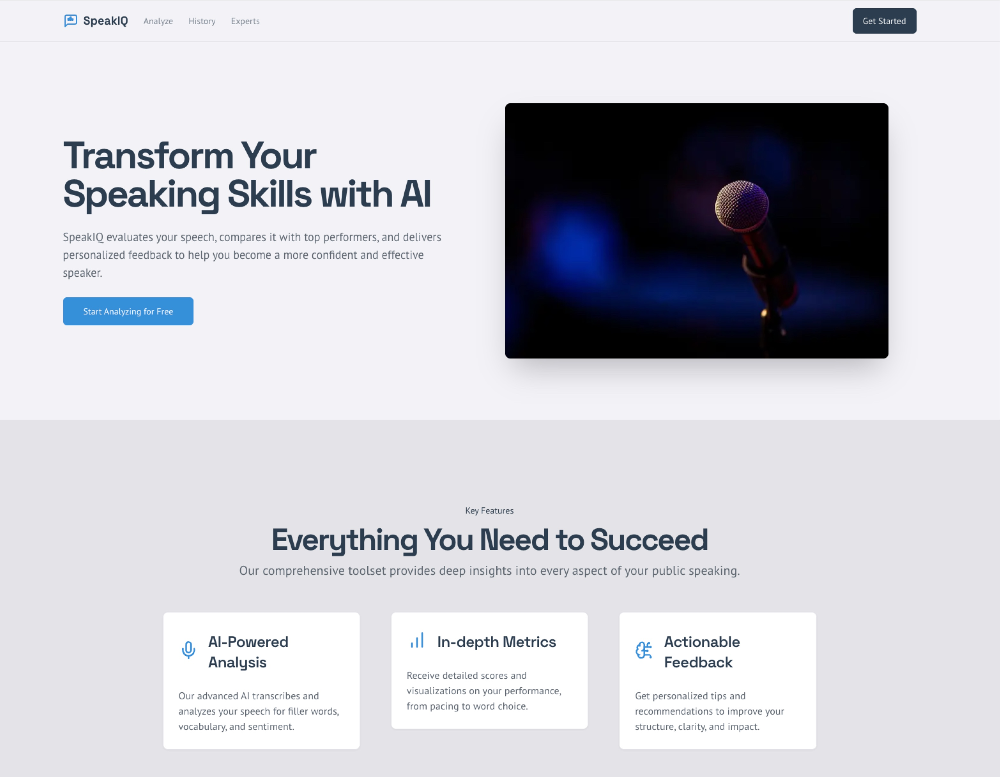

# SpeakIQ - Your AI-Powered Speech Coach

SpeakIQ is a web application built with Next.js that acts as your personal public speaking coach. It uses the power of Google's Gemini AI to analyze your speech and provide detailed, actionable feedback. Whether you're preparing for a presentation, interview, or just want to improve your daily communication, SpeakIQ is here to help you speak with confidence and clarity.

## ✨ Key Features

- **Dual Input Modes**: Analyze your speech by either **recording audio directly** in the browser or **pasting a pre-written transcript**.
- **Comprehensive AI Analysis**: Our backend, powered by Genkit and the Gemini model, processes your speech to deliver deep insights.
- **The SpeakIQ Score**: Get a single, easy-to-understand score that represents your overall communication effectiveness.
- **Detailed Metrics Panel**: Dive deep into the specifics with stats on:
    - **Filler Words**: Counts of "um," "ah," "like," and other common filler words.
    - **Sentence Complexity**: Analysis of the variety and structure of your sentences.
    - **Vocabulary Richness**: A score on the diversity and impact of your word choice.
    - **Pacing**: Your speaking rate measured in words per minute (WPM).
    - **Sentiment**: An analysis of the emotional tone of your speech.
- **Expert Comparison**: See how your speaking style stacks up against different **Expert Archetypes** (e.g., The Visionary, The Storyteller) with a visual radar chart.
- **Personalized Recommendations**: Receive concrete, AI-generated tips tailored to your specific performance to help you improve.
- **Analysis History**: Track your progress over time with a history of all your past analyses and see your SpeakIQ score evolve.

## 🖼 Interactive Slideshow

Explore SpeakIQ visually with this interactive carousel:

<div style="max-width:600px; margin:auto; text-align:center;">
  <div style="position:relative;">
    
    <button onclick="prevSlide()" style="position:absolute; top:50%; left:0; transform:translateY(-50%); background:#fff; border:none; padding:5px 10px; cursor:pointer;">&#10094;</button>
    <button onclick="nextSlide()" style="position:absolute; top:50%; right:0; transform:translateY(-50%); background:#fff; border:none; padding:5px 10px; cursor:pointer;">&#10095;</button>
  </div>
  <p id="caption" style="margin-top:10px;">Step 1: Upload your transcript or record your speech.</p>
</div>

<script>
  const slides = [
    { src: "slide1.jpg", caption: "Step 1: Upload your transcript or record your speech." },
    { src: "slide2.jpg", caption: "Step 2: AI analyzes your speech, identifying key metrics and areas to improve." },
    { src: "slide3.jpg", caption: "Step 3: Detailed dashboard shows your SpeakIQ score, filler words, pacing, and sentiment." },
    { src: "slide4.jpg", caption: "Step 4: Compare your performance with expert archetypes and receive personalized tips." }
  ];

  let current = 0;

  function showSlide(index) {
    const slide = slides[index];
    document.getElementById("slide").src = slide.src;
    document.getElementById("caption").innerText = slide.caption;
  }

  function nextSlide() {
    current = (current + 1) % slides.length;
    showSlide(current);
  }

  function prevSlide() {
    current = (current - 1 + slides.length) % slides.length;
    showSlide(current);
  }
</script>

## 🚀 Getting Started

To run SpeakIQ locally, you'll need Node.js and a package manager (like npm or yarn).

### 1. Install Dependencies

In your terminal, navigate to the project directory and run:

```bash
npm install
